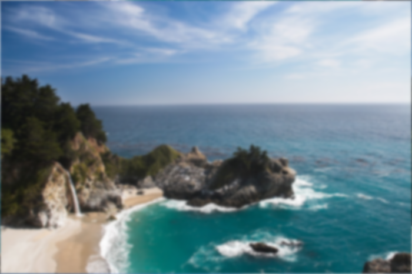
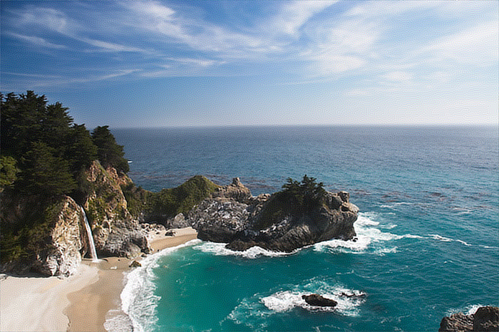

# deconvolution

[](https://crates.io/crates/deconvolution) [](LICENSE)

| Original | Deconvolved |
| --- | --- |
|  |  |

_Before (left) is the motion-blurred sample; after (right) is restored using `wiener_with`._

Rust image deconvolution and restoration library.

Recovering images from blur depends on a point-spread function, stable
frequency-domain utilities, and careful regularization. `deconvolution`
provides known-PSF restoration, blind workflows, PSF/OTF conversion,
preprocessing helpers, simulation fixtures, and ndarray APIs.

### Overview

- **Image-first API**: Top-level functions operate on `image::DynamicImage`
  and return image buffers suitable for saving or further processing.
- **Known-PSF restoration**: Includes inverse filters, Wiener-family methods,
  Richardson-Lucy variants, iterative least-squares methods, constrained
  solvers, sparse/proximal methods, Krylov methods, and MLE-style solvers.
- **PSF and OTF tooling**: Provides owned `Kernel2D`/`Kernel3D` and
  `Transfer2D`/`Transfer3D` types, plus PSF generators, support utilities,
  and `psf2otf`/`otf2psf` conversions.
- **Blind deconvolution**: Includes blind Richardson-Lucy, blind maximum
  likelihood, and parametric blind workflows with PSF constraints.
- **Preprocessing and simulation**: Edge tapering, apodization, NSR
  estimation, deterministic blur/noise helpers, and synthetic fixtures are
  available for testing and examples.
- **ndarray API**: Public `nd` modules expose 2D and 3D array workflows
  for users who want to bypass `DynamicImage` conversion.

### Installation

```bash
cargo add deconvolution
```

```toml
[dependencies]
deconvolution = "0.1.0"
```

The crate uses `image` as its image API. Applications that load or save image
files directly should also depend on `image`:

```bash
cargo add image
```

`rayon` is enabled by default and enables the rayon features on `ndarray` and `image`
rayon feature flags. Disable default features for a serial build:

```toml
[dependencies]
deconvolution = { version = "0.1.0", default-features = false }
```

### Quick Start

```rust
use deconvolution::psf::basic::gaussian2d;
use deconvolution::spectral::{wiener_with, Wiener};

fn main() -> Result<(), Box<dyn std::error::Error>> {
    let input = image::open("before_deconvolution.png")?;
    let psf = gaussian2d((15, 15), 2.15)?;

    let restored = wiener_with(&input, &psf, &Wiener::new().nsr(2.5e-4))?;
    restored.save("after_deconvolution.png")?;

    Ok(())
}
```

### Image API, Channels, and Policies

The primary API accepts `image::DynamicImage` values. Current image-facing
algorithms support these `DynamicImage` variants:

- `ImageLuma8`
- `ImageLumaA8`
- `ImageRgb8`
- `ImageRgba8`

Configuration enums are shared across algorithm families:

- **`Boundary`**: `Zero`, `Replicate`, `Reflect`, `Symmetric`, `Periodic`
- **`Padding`**: `None`, `Same`, `Minimal`, `NextFastLen`, `Explicit2`,
  `Explicit3`
- **`ChannelMode`**: `Independent`, `LumaOnly`, `IgnoreAlpha`,
  `PremultipliedAlpha`
- **`RangePolicy`**: `PreserveInput`, `Clamp01`, `ClampNegPos1`, `Unbounded`

Use `ChannelMode::Independent` for per-channel color restoration,
`ChannelMode::LumaOnly` when the blur should primarily affect luminance, and
`RangePolicy::PreserveInput` when working in normal 8-bit image ranges.

### PSFs, OTFs, and Support Utilities

Basic PSF generators:

- `delta2d`, `delta3d`
- `gaussian2d`, `gaussian3d`
- `motion_linear`
- `disk`, `pillbox`, `defocus`
- `box2d`, `box3d`
- `oriented_gaussian`

Blind initialization helpers:

- `psf::init::uniform`
- `psf::init::gaussian_guess`
- `psf::init::motion_guess`
- `psf::init::from_support`

Support utilities:

- `normalize`, `normalize_3d`
- `center`, `center_3d`
- `pad_to`, `pad_to_3d`
- `crop_to`, `crop_to_3d`
- `flip`, `flip_3d`
- `validate`, `validate_3d`
- `support_mask`, `support_mask_3d`

Transfer conversion utilities:

- `otf::convert::psf2otf`
- `otf::convert::psf2otf_3d`
- `otf::convert::otf2psf`
- `otf::convert::otf2psf_3d`

Optical and microscopy models:

- `BornWolfParams` / `born_wolf`
- `GibsonLanniParams` / `gibson_lanni`
- `VariableRiGibsonLanniParams` / `variable_ri_gibson_lanni`
- `RichardsWolfParams` / `richards_wolf`
- `lorentz2d`
- `astigmatic`
- `double_helix`
- `otf::spectra::koehler_otf`
- `otf::spectra::defocus_otf`

### Known-PSF Deconvolution Method Families

#### Spectral and inverse filters

Frequency-domain methods for fast known-kernel restoration.

- `naive_inverse_filter`
- `inverse_filter`
- `truncated_inverse_filter`
- `regularized_inverse_filter`
- `tikhonov_inverse_filter`
- `wiener`
- `unsupervised_wiener`

Configuration types:

- `InverseFilter`
- `RegularizedInverseFilter`
- `TikhonovInverseFilter`
- `Wiener`
- `UnsupervisedWiener`

Each method also exposes a `_with` variant for explicit configuration.

#### Richardson-Lucy and regularized RL

Poisson-style multiplicative restoration with positivity-aware updates.

- `richardson_lucy`
- `damped_richardson_lucy`
- `richardson_lucy_tv`

Configuration types:

- `RichardsonLucy`
- `RichardsonLucyTv`

#### Iterative least-squares methods

Residual-update solvers for deterministic restoration workflows.

- `landweber`
- `van_cittert`
- `tikhonov_miller`
- `ictm`

Configuration types:

- `Landweber`
- `VanCittert`
- `TikhonovMiller`
- `Ictm`

#### Constrained solvers

Bound-aware restoration methods.

- `nnls`
- `bvls`

Configuration types:

- `Nnls`
- `Bvls`

#### Sparse and proximal methods

Proximal-gradient solvers with sparse-basis control.

- `ista`
- `fista`

Configuration and model types:

- `Ista`
- `Fista`
- `SparseBasis`

#### Krylov and advanced iterative methods

Scientific-imaging style iterative families.

- `mrnsd`
- `cgls`
- `wpl`
- `hybr`

Configuration types:

- `Mrnsd`
- `Cgls`
- `Wpl`
- `Hybr`

#### Maximum-likelihood family

Microscopy-oriented MLE-style restoration methods.

- `cmle`
- `gmle`
- `qmle`

Configuration types:

- `Cmle`
- `Gmle`
- `Qmle`

### Blind Deconvolution

Blind workflows estimate both the restored image and the PSF.

- `blind::richardson_lucy`
- `blind::maximum_likelihood`
- `blind::parametric`

Configuration and output types:

- `BlindRichardsonLucy`
- `BlindMaximumLikelihood`
- `BlindParametric`
- `BlindOutput<I>`
- `BlindReport`
- `ParametricPsf`
- `PsfConstraint`

PSF constraints:

- `Nonnegative`
- `NormalizeSum`
- `SupportMask(...)`

Parametric PSF families:

- `Gaussian { sigma }`
- `MotionLinear { length, angle_deg }`
- `Defocus { radius }`
- `OrientedGaussian { sigma_major, sigma_minor, angle_deg }`

### ndarray Workflows

The public `nd` module exposes array-first workflows for users who already work
in ndarray or need 3D volumes.

2D known-PSF methods in `nd::known_psf`:

- `wiener`, `unsupervised_wiener`
- `richardson_lucy`, `richardson_lucy_tv`
- `landweber`, `van_cittert`, `tikhonov_miller`, `ictm`
- `nnls`, `bvls`
- `ista`, `fista`
- `mrnsd`, `cgls`, `wpl`, `hybr`

Blind methods in `nd::blind`:

- `richardson_lucy`
- `maximum_likelihood`

3D and microscopy methods in `nd::microscopy`:

- `wiener`
- `richardson_lucy`
- `richardson_lucy_tv`
- `cmle`
- `gmle`
- `qmle`

### Preprocessing

Preprocessing utilities help reduce ringing and prepare numerical inputs.

- `preprocess::apodize`
- `preprocess::apodize::window_edges`
- `preprocess::edgetaper`
- `preprocess::estimate_nsr`
- `preprocess::normalize_range`

Use `edgetaper` or apodization before frequency-domain deconvolution when
strong edge discontinuities create ringing artifacts.

### Simulation and Fixtures

Simulation utilities are deterministic and useful for tests, examples, and
benchmark inputs.

Blur and degradation:

- `simulate::blur::blur`
- `simulate::blur::blur_otf`
- `simulate::blur::degrade`

Noise models:

- `simulate::noise::add_gaussian_noise`
- `simulate::noise::add_poisson_noise`
- `simulate::noise::add_readout_noise`

Synthetic fixtures:

- `simulate::phantom::checkerboard_2d`
- `simulate::phantom::gaussian_blob_2d`
- `simulate::phantom::rgb_edges_2d`
- `simulate::phantom::phantom_3d`

### Optional rayon Integration

`rayon` is the only crate feature and is enabled by default.

```toml
[features]
default = ["rayon"]
rayon = ["dep:rayon", "ndarray/rayon", "image/rayon"]
```

Disable default features for serial builds:

```bash
cargo test --no-default-features
```

### Example Programs

Image-facing workflows:

```bash
cargo run --example wiener -- input.png output.png
cargo run --example richardson_lucy
cargo run --example blind_motion
cargo run --example edgetaper
cargo run --example custom_regularizer
```

Volume workflow:

```bash
cargo run --example microscopy_volume
```

### Benchmarks and Development

Bench families (`criterion`):

- `spectral`
- `rl`
- `blind`
- `volume`

```bash
cargo bench --no-run
cargo bench --bench spectral
cargo bench --bench rl
cargo bench --bench blind
cargo bench --bench volume
```

Development checks:

```bash
cargo fmt --all -- --check
cargo clippy --workspace --all-targets --all-features -- -D warnings
cargo check --all-features
cargo test --workspace --all-targets --all-features
cargo doc --workspace --no-deps --all-features
```

### Limitations and Scope

- The image-facing API currently supports 8-bit Gray, GrayAlpha, Rgb, and Rgba
  `DynamicImage` variants.
- Deconvolution quality depends heavily on the PSF, boundary assumptions, and
  regularization strength.
- Aggressive inverse filtering can amplify noise and ringing; prefer Wiener,
  damping, TV regularization, edge tapering, or constrained solvers for noisy
  inputs.
- Blind deconvolution is sensitive to initialization and PSF constraints.

## License

deconvolution is licensed under the [MIT License](LICENSE), copyright (c) 2026 pbkx.

